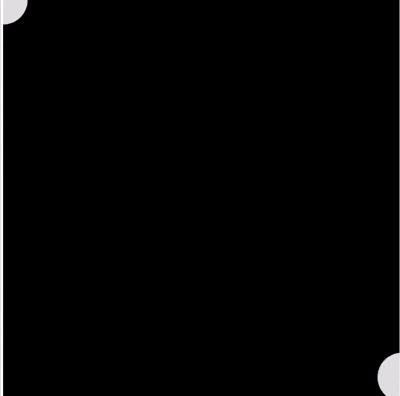

# 2D Graphics Library in JavaScript


## 📌 Introduction

This is a lightweight 2D graphics library built in JavaScript. Inspired by libraries like p5.js, this project was developed as part of my college assignment to understand and implement graphics programming concepts using the HTML5 Canvas API.

## 🚀 Getting Started

- Download 2dAnimationLib.js file <a href="https://github.com/RitikRajput696/2dAnimationLib/releases/download/v1/2dAnimationLib.js">download</a>
- Alternatively clone this repository

```bash
git clone https://github.com/RitikRajput696/2dAnimationLib
```

### Include in HTML

```html
<!DOCTYPE html>
<html lang="en">
  <head>
    <meta charset="UTF-8" />
    <meta name="viewport" content="width=device-width, initial-scale=1.0" />
    <title>Document</title>
  </head>
  <body>
    <canvas id="canvas"></canvas>
    <script type="module" src="2dAnimationLib.js"></script>
    <script type="module">
      import { createCanvas, startLoop, rect } from "./src/2dAnimationLib.js";

      // creating our drawing canvas 600x400
      createCanvas(600, 400);

      let x = 0;

      function draw() {
        background("white");
        fill("blue");
        rect(x, 100, 50, 50);
        x += 1;
      }

      // function to animate, it runs at 60fps
      startLoop(draw);
    </script>
  </body>
</html>
```

## 🧱 Core Functions

### Canvas

- `createCanvas(width, height)` — Sets up a canvas of specified dimensions. To create full screen canvas use `window.innerWidth` and `window.innerHeight`
- `background(color)` — Sets the background color.

### Shapes

- `point(x, y)`
- `line(x1, y1, x2, y2)`
- `rect(x, y, w, h)`
- `circle(x, y, d)`
- `ellipse(x, y, w, h)`
- `arc(x, y, w, h, start, stop, open)`

### Style

- `fill(color)` — Sets fill color.
- `stroke(color)` — Sets stroke color.
- `noStroke()` — Disables stroke.
- `strokeWeight(weight)` — Sets stroke thickness.
- `randomColor(alpha)` — Generates random RGBA color.

### Text

- `text(str, x, y)` — Draws text.
- `textFont(fontName)` — Sets font Family.
- `textSize(size)` — Sets font size.
- `textAlign(h, v)` — Horizontal (`start`, `center`, `end`) and vertical (`top`, `middle`, `bottom`, `alphabetic`) alignment.

### Transformations

- `push()` — Saves current canvas state.
- `pop()` — Restores last saved canvas state.
- `translate(x, y)` — Moves origin.
- `rotate(angle)` — Rotates canvas (radians).
- `scale(sx, sy)` — Scales canvas.

### Animation

- `startLoop(drawFn)` — Continuously calls `drawFn()` to enable animation.

### Mouse Input

- `mouseX`, `mouseY` — Coordinates of the mouse relative to the canvas.

## 🔁 Examples

### 1. Bouncing Balls


```js
import {
  createCanvas,
  background,
  startLoop,
  circle,
  pop,
  translate,
  fill,
  randomColor,
} from "../src/2dAnimationLib.js";

createCanvas(window.innerWidth, window.innerHeight);

console.log(window.innerWidth, innerHeight);

let circleArray = [];

for (let i = 0; i < 100; i++) {
  let radius = Math.random() * (100 - 30) + 30;
  circleArray.push({
    radius: radius,
    circleX: Math.random() * (window.innerWidth - radius - radius) + radius,
    circleY: Math.random() * (window.innerHeight - radius - radius) + radius,
    color: randomColor(),
    dy: Math.random() * (6 - 1) + 1,
  });
}

let ySpeed = 2;

function draw() {
  background("white");

  for (let i = 0; i < circleArray.length; i++) {
    fill(circleArray[i].color);
    circle(
      circleArray[i].circleX,
      circleArray[i].circleY,
      circleArray[i].radius
    );
    circleArray[i].circleY += circleArray[i].dy;

    if (
      circleArray[i].circleY < 0 ||
      circleArray[i].circleY > window.innerHeight - circleArray[i].radius
    ) {
      circleArray[i].dy *= -1;
    }
  }
}

startLoop(draw);
```

### 2. Rotating Rectangle

```js
createCanvas(window.innerWidth, window.innerHeight);
let angle = 0;

function draw() {
  background("white");
  push();
  translate(window.innerWidth / 2, window.innerHeight / 2);
  rotate(angle);
  fill("green");
  rect(-100, -100, 100, 100);
  pop();
  angle += 0.05;
}

startLoop(draw);
```

### 3. Infinity circles



```js
createCanvas(800, 800);
background("black");

function draw() {
  fill("#dbdbdb");
  circle(mouseX, mouseY, 100);
}

startLoop(draw);
```
